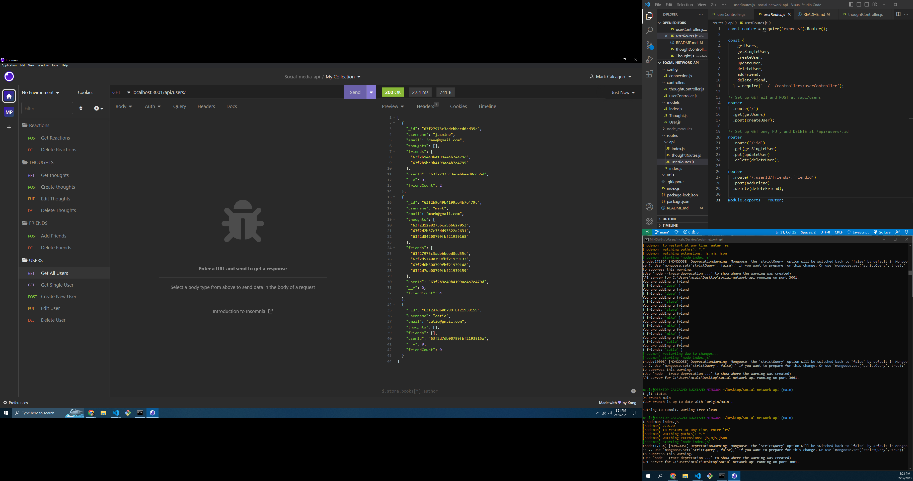

# Social Network API

## Description
In this application, the user will be able to create a simple profile, edit and delete aspects of their profile, add friends, thoughts and reactions, as well as edit and delete those friends, thoughts and reactions. The videos and screenshot below demonstrate this. 

## Table of Contents
- [Installation](#installation)
- [Usage](#usage)
- [Credits](#credits)

## Installation
Programs necessary for usage is Node.js, but dependencies must be added for it to work.  Inquirer, Jest and Express must be installed into the node_modules folder using, "npm install 'program'".  Finally, this must be run using Node.js, and it cannot be deployed.

## Usage
If one has correctly downloaded the necessary code and has access to what has been written by me, then open the console and navigate to the main folder.  Input "node index.js", and the questionaire will begin.  The user will be provided with a series of options; viewing the employees, roles and departments, and editing the employees, roles and departments.  On screen instructions allow the user to easily add or update previous entries.  In order for anyone to interact with the code, you must use Insomnia

## Screenshot

## Links
Video demo of Application: https://youtu.be/IZryWWOeFzk 
Github: https://github.com/mcalcagno47/social-network-api   

The site: Not applicable in this situation, as it is running locally.  Please use Insomnia to see, edit and delete posts from this assignment.

## Credits
Mark Calcagno
